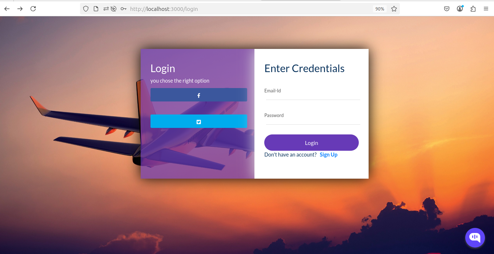
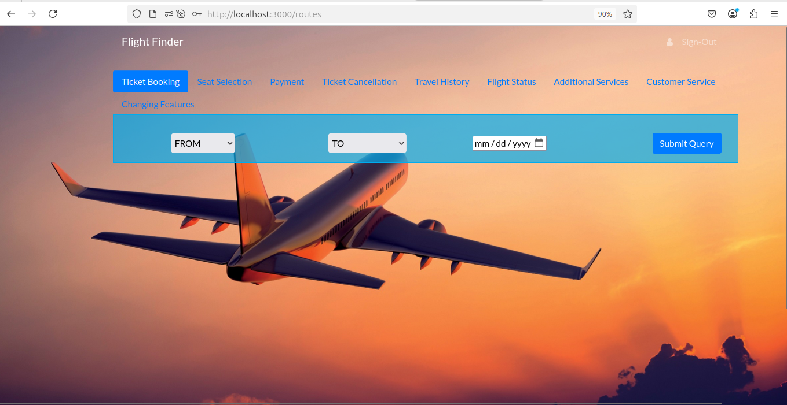
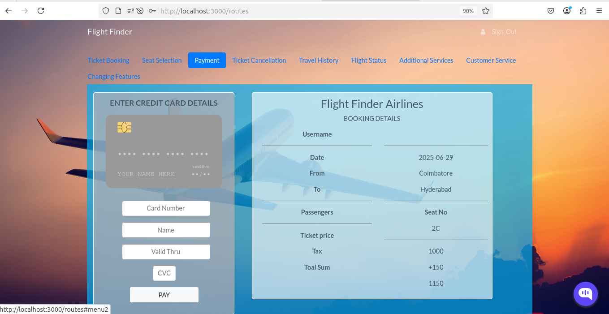
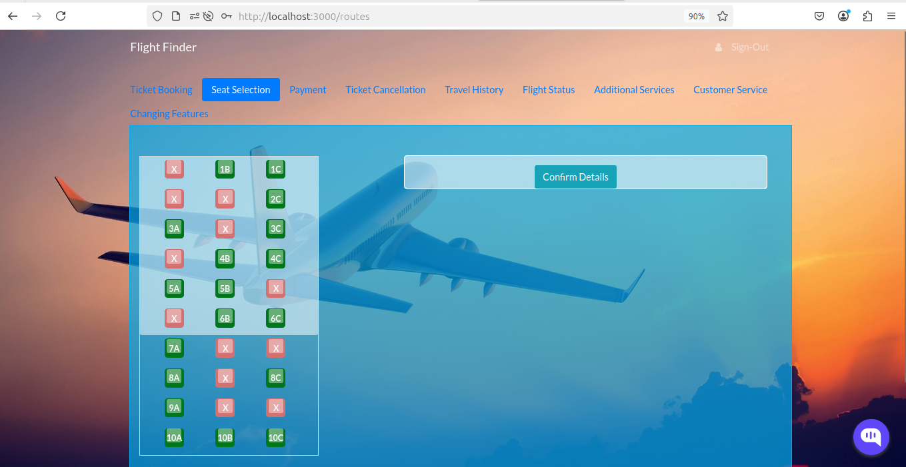
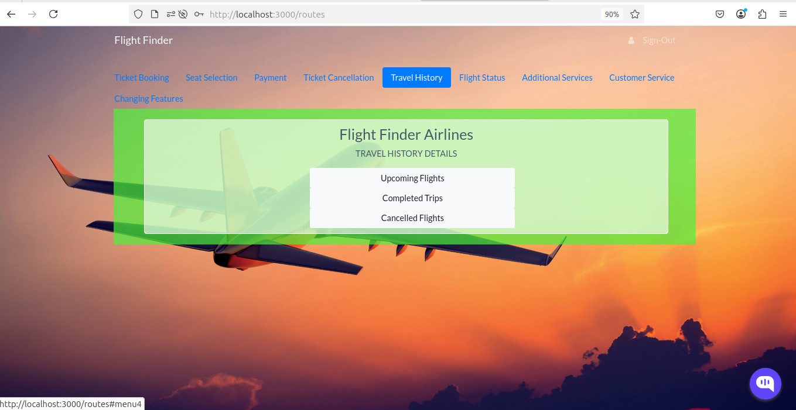

# ✈️ FlightFinder: Navigating Your Air Travel Options

A full-stack web application to search and view available bus routes between two cities. Built using the **MERN Stack** (MongoDB, Express.js, React.js, Node.js) as part of the **SmartBridge Full Stack Internship**.

---

## 👨‍💻 Team Members

- 👩‍💻 Gnanalahari Pudi
- 👩 Ramya
- 👨 Ramakrishna
- 👨‍💻 Siddi Vinayaka

---

## 🚀 Features

### 👤 User Side
- 🔐 User registration and login
- 🌍 Select source and destination cities from dropdown
- 📅 Select travel date
- 🔍 Fetch available buses from the database
- 🧾 Display list of available buses with details

### ⚙️ Admin (optional future module)
- Add new bus details
- View and manage bookings

---

## 📁 Folder Structure

FlightFinder/
├── client/ # React Frontend
│ └── src/
│ ├── components/
│ │ ├── LogOrSign.js
│ │ ├── Routeselector.js
│ │ ├── BusList.js
│ ├── App.js
│ └── index.js
├── server/ # Express Backend
│ ├── models/
│ │ ├── bookingModel.js
│ │ └── userModel.js
│ ├── routes/
│ │ ├── userRoutes.js
│ │ └── bookingRoutes.js
│ ├── controllers/
│ │ └── controller files here
│ └── server.js # Main backend entry point
├── README.md
└── package.json


---

## 🧰 Technologies Used

| Tech         | Purpose                    |
|--------------|-----------------------------|
| React.js     | Frontend UI                |
| Express.js   | Backend framework          |
| MongoDB      | Database (local)           |
| Node.js      | Runtime for backend        |
| Axios        | API requests               |
| Bootstrap    | Styling                    |
| Thunder Client / Postman | API Testing   |

---

## 🛠️ Setup Instructions

### 1. Clone the repository

```bash
git clone https://github.com/<your-username>/FlightFinder.git
cd FlightFinder


# Frontend
cd client
npm install

# Backend
cd ../server
npm install


# Start backend
cd server
npm run devStart

# Start frontend (in a separate terminal)
cd client
npm start

## 📸 Screenshots

### 🔐 Login Page


### 🧭 Route Selector


### 🚌 payment


### 📝 Seat Selection


### 📝 Ticket Cancellation
 

### 📝 Travel History


